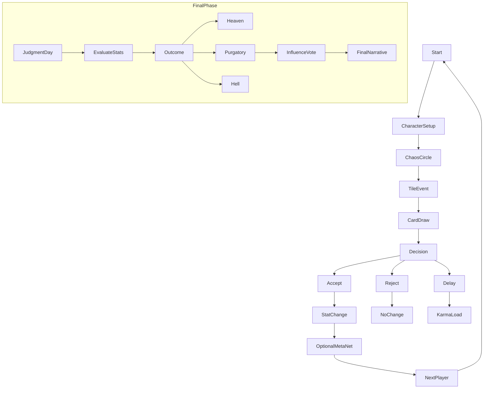

# Reality Check: Casual Mode – Game Logic & Board Description

## Overview

Reality Check: Casual Mode is a fast-paced, browser-based satirical board game for 3–5 players. Set in the fictional town of Babel, the game explores modern adult life through absurdity, moral dilemmas, and unpredictable social events.

This mode is optimized for 30–45 minute sessions and focuses on humor, chaos, and reflection. It is designed to be quick to learn, endlessly replayable, and light enough for casual players, but deep enough to reward repeat playthroughs.

---

## Core Gameplay Loop

1. **Roll & Move** – Player rolls and moves on the Chaos Circle board.
2. **Resolve Tile** – Trigger event based on tile category.
3. **Draw Card** – Draw one card from either Sin or Virtue deck (based on tile type).
4. **Make a Decision** – Accept, reject, or delay the card’s offer.
5. **Optional MetaNet Post** – Influence public eye using a prewritten post.

---

## Core Stats (4)

| Stat             | Description                                           |
| ---------------- | ----------------------------------------------------- |
| 💰 Money         | Financial standing. Affects ability to resist crises. |
| 🧠 Mental Health | Represents burnout, anxiety, or mental clarity.       |
| ☠️ Sin           | Measures morally selfish or destructive actions.      |
| ✝️ Virtue        | Measures self-sacrifice, altruism, and grace.         |

---

## Point System

Each stat plays a role in the endgame evaluation. Points are accrued or lost based on decisions:

- 💰 **Money**: +1 point per \$1,000 at end of game (max 20)
- 🧠 **Mental Health**: +1 point per 2 stability units (scale 0–10)
- ☠️ **Sin**: -1 point per Sin card accepted, +1 if repented before death
- ✝️ **Virtue**: +1 point per Virtue card accepted, +2 for major sacrifices

### Bonuses:

- +5 bonus points if Sin is below 3 AND Virtue is above 8
- +3 bonus points if Mental Health stays above 7 entire game
- +2 bonus points if you die early but assist other players from Purgatory

Final scores are used to determine your Judgment Day outcome, but **scores are not revealed until the end** to keep the game emotional and reactive rather than gamified.

---

## Card Types (Casual Mode)

- **Sin Cards** – Temptations (e.g., scams, betrayals, secrets).
- **Virtue Cards** – Opportunities for charity, forgiveness, or moral strength.
- Each card alters stats and may introduce delayed effects or secret conditions.

---

## Board: The Chaos Circle

The Chaos Circle is rendered with **nested hypocycloid paths**—curves generated by rolling circles—so the virtual board is vivid yet mathematically tidy.  Each ring uses a distinct hypocycloid equation *and* a unique color, letting players instantly recognize what slice of life they’ve landed in.

| Ring (Color)                | Curve & Ratio         | Life Domain                                   | What Happens on These Tiles?                                                                                                      |
| --------------------------- | --------------------- | --------------------------------------------- | --------------------------------------------------------------------------------------------------------------------------------- |
| **Career** (Red)            | Deltoid (3‑cusp, 3:1) | Jobs, promotions, layoffs, corporate scandals | Adjust 💰 Money up/down, stress Mental Health, may trigger Sin offers (embezzlement, bribery) or Virtue offers (mentoring intern) |
| **Health** (Gold)           | Astroid (4‑cusp, 4:1) | Physical & mental well‑being                  | Modify 🧠 Mental Health; draw cards like “Ignore the lump?” (Sin) or “Therapy Breakthrough” (Virtue)                              |
| **Social** (Cyan)           | 5‑cusp, 5:1           | Relationships, gossip, family drama           | Tweak Social interactions via MetaNet prompts; encounter betrayal, marriage, divorce, public humiliation                          |
| **Personal Growth** (Green) | 6‑cusp, 6:1           | Hobbies, spirituality, side hustles           | Gain Virtue for selfless acts, risk Sin through vices; chance to boost Mental Health or blow 💰 on a doomed startup               |
| **Babel Events** (Purple)   | Double‑cusp (2:1)     | Town‑wide crises & booms                      | Affect *everyone*—inflation, war draft, viral trend; can spike Sin (panic hoarding) or Virtue (community aid)                     |

### Implementation Hint

`generateHypocycloid(R, r, steps)` returns coordinate arrays.  Offset each ring’s radius so paths never overlap, then stroke them with their color above.

### Tile Placement Rules

1. Divide each curve into **10 equal arc‑length segments**.
2. Drop a tile marker (small circle) at each segment midpoint.  The marker inherits the ring’s color.
3. Label the marker with its domain icon (🏢 Career, ⚕️ Health, 💬 Social, 🌱 Personal, 📢 Babel).
4. **Landing on a tile** instantly triggers an event of that ring’s type.

### Why Hypocycloids?

- **Visual clarity**: sharper cusps → clear domain boundaries.
- **Mathematical symmetry**: easy to script in SVG/Canvas with one parametric function.
- **Game feel**: the sharper the curve, the more "chaotic" the life domain feels—mirroring real‑world unpredictability.

---

### Personal Sub‑Ring Modifiers

During character setup, each player selects **two Life‑Bias Modifiers** and **one Drawback Modifier**.  These tweak the effective radius of specific rings only **for that player**, making their life path feel uniquely weighted without redrawing the shared board.

| Modifier                     | Effect on Rings       | Gameplay Result                                                        |
| ---------------------------- | --------------------- | ---------------------------------------------------------------------- |
| **Career Junkie**            | Career radius ×1.15   | Encounters more Career tiles → faster money swings & burnout risk      |
| **Fragile Health**           | Health radius ×1.20   | Higher chance of Health events → mental‑health volatility              |
| **Social Butterfly**         | Social radius ×1.20   | More gossip & relationship drama → boosts or tanks Rep quickly         |
| **Zen Minimalist**           | Personal radius ×1.25 | Increased Personal‑Growth events → easier Virtue gains but less income |
| **Crisis Magnet** (Drawback) | Babel radius ×1.30    | Global events hit you harder (± modifiers doubled)                     |

**Coding Hook:** `renderPlayerOverlay(mods)` overlays a dashed SVG path using each player’s radius multipliers.  Card logic references the same multipliers to select variant event decks (e.g., Career‑HighRisk, Health‑Fragile).

> *Design Goal*: players feel fated toward certain life domains, yet can still outplay destiny through decisions.

Every 5 turns, a **Global Event** (purple ring) hits all players—war, inflation, viral outrage—forcing everyone to react. \*\* hits all players (e.g., war, inflation, viral trend).\*\* hits all players (e.g., war, inflation, viral trend).

---

## Judgment Day (End of Game)

After 10 rounds, the game ends and all players face **Judgment Day**:

- Your total **Sin vs Virtue** is evaluated.
- Outcomes: **Heaven**, **Purgatory**, or **Hell**.
- Purgatory players vote to boost or curse one other player.

---

## Endgame Roles (Examples)

- **The Saint** – High Virtue, low Sin.
- **The Hustler** – High Money, morally grey.
- **The Burnout** – Mentally destroyed, but survived.
- **The Ghost** – Died early, influenced from beyond.

---

## Obsidian-Compatible Mermaid Diagram

---

## Replayability

- Modular card decks.
- Randomized player identities.
- Multiple moral pathways.
- Satirical endgame labels for every outcome.

Future expansions will include:

- Advanced Mode with Secrets, Red Line Protocol, and Control Chains.
- MetaNet AI reaction layers.
- Physical board game adaptation.

---

## Developer Notes

This Casual Mode serves as a foundation for testing core mechanics, satire pacing, and emergent social dynamics. All advanced logic systems (e.g., judgment influence, power structures) are modular add-ons.

Use this blueprint to begin prototyping core systems and player feedback loops.

