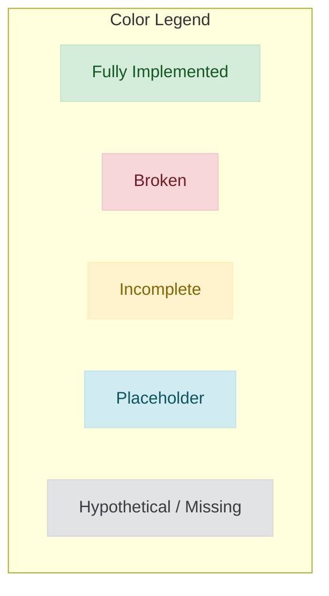
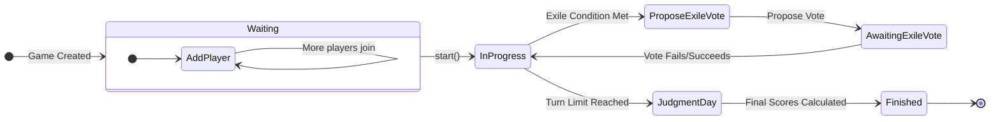
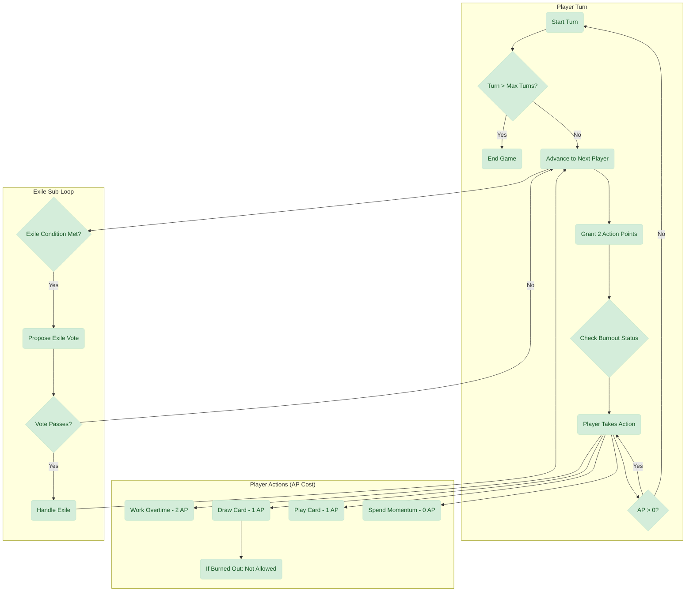

# Game Logic & Implementation Map
*As of 2025-09-27*

This document provides a detailed, color-coded visual map of the game's core logic and its current implementation status.

## Legend

---

## 1. Master Game State Diagram

This diagram shows the primary states of the `Game` object and the transitions between them. All core state transitions are fully implemented.

---

## 2. Core Player Turn Loop

This diagram details the sequence of events that occur during a single player's turn. The core loop and available actions are functional.

---

## 3. Bot Strategy Analysis

This diagram maps each bot strategy to its core decision-making logic and identifies its implementation status.

```mermaid
graph TD
    subgraph Bot Strategies
        direction LR
        BS(Bot Client) --> R(RandomStrategy):::implemented;
        BS --> H(HustlerStrategy):::implemented;
        BS --> Z(ZenStrategy):::implemented;
        BS --> P(PuppeteerStrategy):::broken;
        BS --> AG(AgitatorStrategy):::incomplete;
    end

    subgraph "Random Logic"
        R --> R1("Action: Any valid action"):::implemented;
        R --> R2("Decision: Random choice"):::implemented;
        R --> R3("Testimony: Random target"):::implemented;
    end

    subgraph "Hustler Logic"
        H --> H1("Goal: Maximize Money & Sin"):::implemented;
        H --> H2("Action: Score-based, prefers WORK_OVERTIME & SIN cards"):::implemented;
        H --> H3("Decision: Chooses option with highest money gain"):::implemented;
        H --> H4("Testimony: Kudos to richest, Concern to poorest"):::implemented;
    end

    subgraph "Zen Logic"
        Z --> Z1("Goal: Maximize Virtue & Mental Health"):::implemented;
        Z --> Z2("Action: Score-based, prefers VIRTUE cards, avoids WORK_OVERTIME"):::implemented;
        Z --> Z3("Decision: Chooses option with highest Virtue/MH gain"):::implemented;
        Z --> Z4("Testimony: Kudos to most virtuous, Concern to most sinful"):::implemented;
    end

    subgraph "Puppeteer Logic (Broken)"
        P --> P1("Goal: Maximize Social Capital"):::broken;
        P --> P2("Action: Prioritizes cards/events that give Social Capital"):::broken;
        P --> P3("Decision: Chooses option with highest Social Capital gain"):::broken;
        P1 & P2 & P3 --> MissingStat1("Depends on: socialCapital stat"):::hypothetical;
    end

    subgraph "Agitator Logic (Incomplete)"
        AG --> AG1("Goal: Cause Disruption (if Exiled)"):::incomplete;
        AG --> AG2("Action: Attempts to play high-disruption SIN cards"):::incomplete;
        AG --> AG3("If not Exiled or no good plays: Falls back to Random logic"):::incomplete;
        AG1 & AG2 --> MissingStat2("Disruption score depends on: socialCapital stat"):::hypothetical;
    end

    classDef implemented fill:#d4edda,stroke:#c3e6cb,color:#155724;
    classDef broken fill:#f8d7da,stroke:#f5c6cb,color:#721c24;
    classDef incomplete fill:#fff3cd,stroke:#ffeeba,color:#856404;
    classDef hypothetical fill:#e2e3e5,stroke:#d6d8db,color:#383d41;
```

---

## 4. Accolade (Title) System

This diagram maps each end-game Title to its dependencies, showing its implementation status.

```mermaid
graph TD
    subgraph "Accolade System"
        direction TB
        GameEnd("Game Ends"):::implemented --> AwardTitles("awardTitles() function"):::implemented;
        AwardTitles --> TitlesJS("titles.js definitions"):::implemented;
    end

    subgraph "Functional Titles (Implemented)"
        TitlesJS --> T_Capitalist("The Capitalist"):::implemented;
        T_Capitalist --> S_Money("Player Stat: Money"):::implemented;
        TitlesJS --> T_Debtor("The Debtor"):::implemented;
        T_Debtor --> S_Money;
        TitlesJS --> T_PennyP("The Penny Pincher"):::implemented;
        T_PennyP --> S_Money;
        T_PennyP --> S_Sin("Player Stat: Sin"):::implemented;
        TitlesJS --> T_Saint("The Saint"):::implemented;
        T_Saint --> S_Virtue("Player Stat: Virtue"):::implemented;
        TitlesJS --> T_Sinner("The Sinner"):::implemented;
        T_Sinner --> S_Sin;
        TitlesJS --> T_Purest("The Purest Soul"):::implemented;
        T_Purest --> S_Virtue;
        T_Purest --> S_Sin;
        TitlesJS --> T_Util("The Utilitarian"):::implemented;
        T_Util --> S_Virtue;
        T_Util --> S_Sin;
        TitlesJS --> T_Survivor("The Survivor"):::implemented;
        T_Survivor --> S_MH("Player Stat: Mental Health"):::implemented;
        TitlesJS --> T_Martyr("The Martyr"):::implemented;
        T_Martyr --> S_MH;
        T_Martyr --> S_Virtue;
        TitlesJS --> T_Burned("The Burned Out"):::implemented;
        T_Burned --> S_Burnout("Player Flag: isBurnedOut"):::implemented;
        TitlesJS --> T_Influencer("The Influencer"):::implemented;
        T_Influencer --> S_Kudos("Player Stat: Kudos"):::implemented;
        TitlesJS --> T_Pariah("The Pariah"):::implemented;
        T_Pariah --> S_Concern("Player Stat: Concern"):::implemented;
        TitlesJS --> T_Cautious("The Cautious"):::implemented;
        T_Cautious --> S_Sin;
        TitlesJS --> T_Middle("The Middle Child"):::implemented;
        T_Middle --> S_Money;
        T_Middle --> S_Virtue;
        T_Middle --> S_Sin;
    end

    subgraph "Non-Functional Titles"
        TitlesJS --> T_Builder("The Community Builder"):::broken;
        T_Builder --> S_Impact("Depends on: communityImpact stat"):::hypothetical;
        TitlesJS --> T_Socialite("The Socialite"):::broken;
        T_Socialite --> S_SC("Depends on: socialCapital stat"):::hypothetical;

        TitlesJS --> T_Workhorse("The Workhorse"):::placeholder;
        T_Workhorse --> D_ActionCount("Depends on: Action Count Tracking"):::hypothetical;
        TitlesJS --> T_Storyteller("The Storyteller"):::placeholder;
        T_Storyteller --> D_EventCount("Depends on: Event Count Tracking"):::hypothetical;
        TitlesJS --> T_Gambler("The Gambler"):::placeholder;
        T_Gambler --> D_RiskTracking("Depends on: Choice Risk Tracking"):::hypothetical;
        TitlesJS --> T_Drama("The Drama Queen"):::placeholder;
        T_Drama --> D_EventCount;
        TitlesJS --> T_Roller("The Rollercoaster"):::placeholder;
        T_Roller --> D_StatHistory("Depends on: Stat History Tracking"):::hypothetical;
    end

    classDef implemented fill:#d4edda,stroke:#c3e6cb,color:#155724;
    classDef broken fill:#f8d7da,stroke:#f5c6cb,color:#721c24;
    classDef placeholder fill:#d1ecf1,stroke:#bee5eb,color:#0c5460;
    classDef hypothetical fill:#e2e3e5,stroke:#d6d8db,color:#383d41;
```

