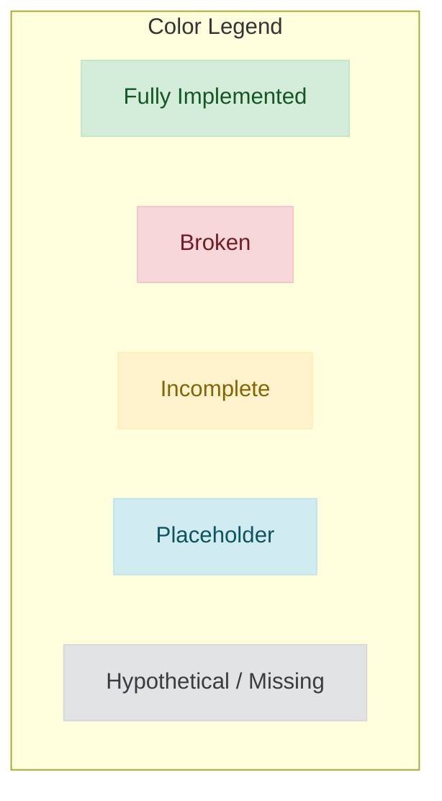
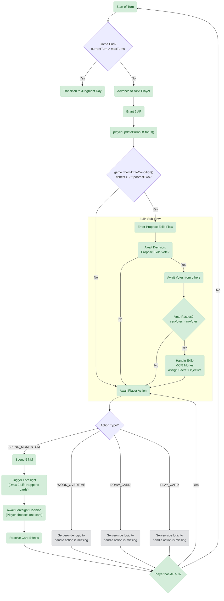

# Game Logic & Implementation Map v2.0
*As of 2025-09-27*

This document provides a highly detailed, color-coded visual map of the game's core logic, focusing on mathematical formulas, decision branches, and specific implementation status. This V2 map expands upon the original to serve as a precise technical reference.

## Legend

---

## 1. Final Scoring & Accolade Logic

This diagram details the precise mathematical formulas and logical conditions for final scoring and the awarding of end-game accolades.

```mermaid
graph TD
    subgraph "Scoring & Accolade Calculation"
        A(Judgment Day Begins):::implemented --> B(Calculate Final Scores):::implemented;

        B --> C{Tally Testimonies}:::implemented;
        C --> C1("For each player:<br/>p.stats.kudos++<br/>p.stats.concern++"):::implemented;

        B --> D{Calculate Builder Bonus}:::broken;
        D --> D1{"topBuilder =<br/>max(p.stats.communityImpact)"}:::broken;
        D1 --> D2{"If topBuilder.communityImpact > 0"}:::broken;
        D2 -- Yes --> D3{"Bonus =<br/>if virtue >= 10 then 3<br/>if virtue >= 5 then 2<br/>if virtue >= 1 then 1"}:::broken
        D1 & D2 & D3 --> D_Err("Depends on: communityImpact stat"):::hypothetical

        B --> E(Calculate Base Score for each Player):::implemented;
        E --> F(MH_Bonus = if MH >= 8 then 10 else if MH >= 5 then 5 else 0):::implemented;
        E --> G("Score = (M/200) + (V*1.5) - (S*1.5) + MH_Bonus + (Kudos*2) - (Concern*2)"):::implemented;

        G --> H(Sort Players by Final Score):::implemented;
        H --> I(Award Titles):::implemented;
    end

    subgraph "Accolade Awarding Logic"
        I --> T_Capitalist("The Capitalist<br/>max(p.stats.money)"):::implemented;
        I --> T_Debtor("The Debtor<br/>min(p.stats.money)"):::implemented;
        I --> T_Saint("The Saint<br/>max(p.stats.virtue)"):::implemented;
        I --> T_Sinner("The Sinner<br/>max(p.stats.sin)"):::implemented;
        I --> T_Survivor("The Survivor<br/>max(p.stats.mentalHealth)"):::implemented;
        I --> T_Influencer("The Influencer<br/>max(p.stats.kudos)"):::implemented;
        I --> T_Pariah("The Pariah<br/>max(p.stats.concern)"):::implemented;
        I --> T_Burned("The Burned Out<br/>find(p.isBurnedOut)"):::implemented;
        I --> T_Middle("The Middle Child<br/>min(abs(p.stats - avg.stats))"):::implemented;
        I --> T_Purest("The Purest Soul<br/>if sin==0, max(virtue)"):::implemented;
        I --> T_Util("The Utilitarian<br/>if sin>10 & virtue>10, max(sin+virtue)"):::implemented;
        I --> T_Martyr("The Martyr<br/>if MH<4, max(virtue)"):::implemented;
        I --> T_Cautious("The Cautious<br/>if sin<2, min(money)"):::implemented;

        I --> T_Socialite("The Socialite<br/>max(p.stats.socialCapital)"):::broken;
        T_Socialite --> SC_Err("Depends on: socialCapital stat"):::hypothetical;

        I --> T_Builder("The Community Builder<br/>max(p.stats.communityImpact)"):::broken;
        T_Builder --> CI_Err("Depends on: communityImpact stat"):::hypothetical;

        I --> T_Workhorse("The Workhorse"):::placeholder;
        T_Workhorse --> WH_Err("Depends on: Action Count Tracking"):::hypothetical;
        I --> T_Storyteller("The Storyteller"):::placeholder;
        T_Storyteller --> ST_Err("Depends on: Event Count Tracking"):::hypothetical;
        I --> T_Gambler("The Gambler"):::placeholder;
        T_Gambler --> G_Err("Depends on: Choice Risk Tracking"):::hypothetical;
        I --> T_Drama("The Drama Queen"):::placeholder;
        T_Drama --> DQ_Err("Depends on: Event Count Tracking"):::hypothetical;
        I --> T_Roller("The Rollercoaster"):::placeholder;
        T_Roller --> R_Err("Depends on: Stat History Tracking"):::hypothetical;
    end

    classDef implemented fill:#d4edda,stroke:#c3e6cb,color:#155724;
    classDef broken fill:#f8d7da,stroke:#f5c6cb,color:#721c24;
    classDef incomplete fill:#fff3cd,stroke:#ffeeba,color:#856404;
    classDef placeholder fill:#d1ecf1,stroke:#bee5eb,color:#0c5460;
    classDef hypothetical fill:#e2e3e5,stroke:#d6d8db,color:#383d41;
```

---

## 2. Granular Player Turn Flow

This diagram provides a granular, step-by-step flowchart of the entire player turn, from initial state checks to action resolution and sub-processes.

---

## 3. Bot Strategy & Decision Logic

This diagram breaks down the specific decision-making logic for each bot strategy, including the scoring functions they use to evaluate and prioritize actions.

```mermaid
graph TD
    subgraph "Bot Strategies & Logic"
        direction LR
        BS(Bot Client) --> R(Random):::implemented;
        BS --> H(Hustler):::implemented;
        BS --> Z(Zen):::implemented;
        BS --> P(Puppeteer):::broken;
        BS --> AG(Agitator):::incomplete;
    end

    subgraph "Random Strategy"
        R --> R1("Action: Picks randomly from valid actions"):::implemented;
        R --> R2("Decision: Picks random option"):::implemented;
    end

    subgraph "Hustler Strategy (Score-Based)"
        H --> H_Goal("Goal: Maximize Money & Sin"):::implemented
        H --> H_Action("chooseAction: Picks highest score"):::implemented
        H_Action --> H_S1("WORK_OVERTIME<br/>score = max(0, MH - 2)"):::implemented
        H_Action --> H_S2("DRAW_CARD (SIN)<br/>score = 3 to 4"):::implemented
        H_Action --> H_S3("PLAY_CARD<br/>score = (money/500) + (sin*1.5)"):::implemented
        H --> H_Decision("makeDecision: Picks option with max money gain"):::implemented
    end

    subgraph "Zen Strategy (Score-Based)"
        Z --> Z_Goal("Goal: Maximize Virtue & MH"):::implemented
        Z --> Z_Action("chooseAction: Picks highest score"):::implemented
        Z_Action --> Z_S1("WORK_OVERTIME<br/>score = -5 (avoids)"):::implemented
        Z_Action --> Z_S2("DRAW_CARD (VIRTUE)<br/>score = 5"):::implemented
        Z_Action --> Z_S3("PLAY_CARD<br/>score = (virtue*2) + MH - (sin*2)"):::implemented
        Z --> Z_Decision("makeDecision: Picks option with max virtue/MH score"):::implemented
    end

    subgraph "Puppeteer Strategy (Priority-Based)"
        P --> P_Goal("Goal: Maximize Social Capital"):::broken
        P --> P_Action("chooseAction Priorities:<br/>1. Play SC cards<br/>2. Spend Momentum<br/>3. Draw Virtue"):::broken
        P --> P_Decision("makeDecision: Picks option with max SC gain"):::broken
        P_Goal & P_Action & P_Decision --> P_Err("Depends on: socialCapital stat"):::hypothetical
    end

    subgraph "Agitator Strategy (Mixed Logic)"
        AG --> AG_Cond{"if exiled?"}:::incomplete
        AG_Cond -- Yes --> AG_Exiled("Goal: Cause Disruption"):::incomplete
        AG_Exiled --> AG_Action("PLAY_CARD (SIN)<br/>Calculates disruption score"):::incomplete
        AG_Action --> AG_Err("Disruption score depends on: socialCapital stat"):::hypothetical
        AG_Cond -- No --> AG_Fallback("Falls back to Random logic"):::incomplete
    end

    classDef implemented fill:#d4edda,stroke:#c3e6cb,color:#155724;
    classDef broken fill:#f8d7da,stroke:#f5c6cb,color:#721c24;
    classDef incomplete fill:#fff3cd,stroke:#ffeeba,color:#856404;
    classDef hypothetical fill:#e2e3e5,stroke:#d6d8db,color:#383d41;
```

